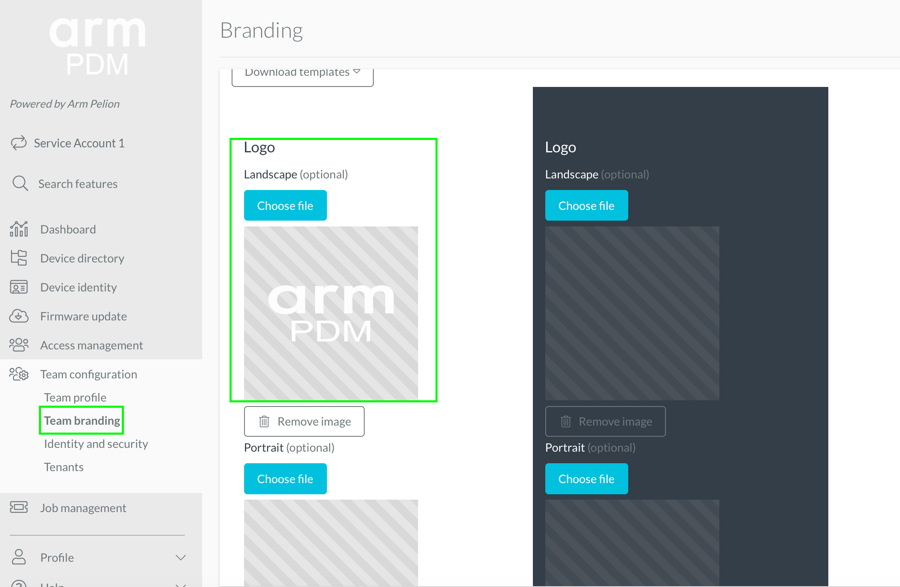

# Custom logo

Follow these steps to update the logo of your PDM account. This will be applied to both the Portal and the PDM mobile app.
1. Navigate to **Team Branding** under **Team Configuration**.
1. Select **Logo** under **Images**
1. Choose **Landscape** and upload the image file.
1. Save the changes.
1. In the mobile app, the new logo is downloaded at login.

