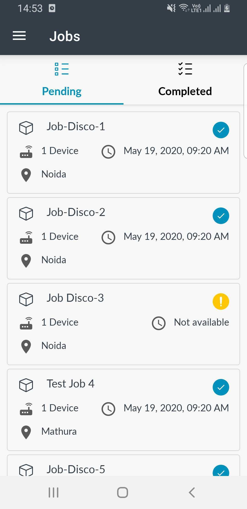
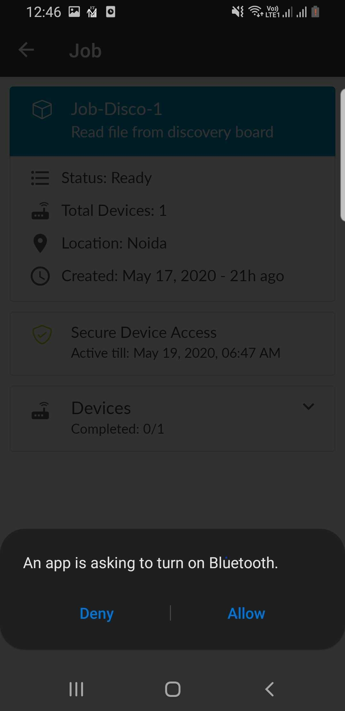
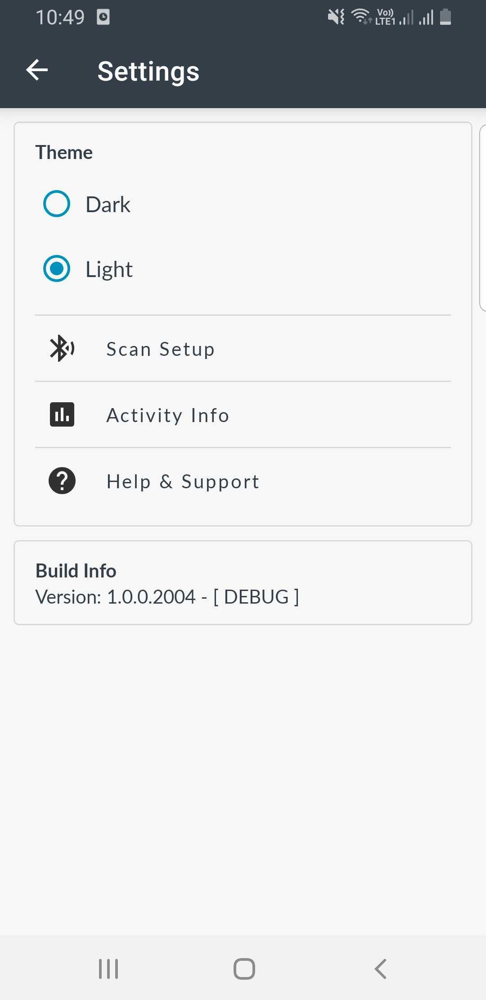
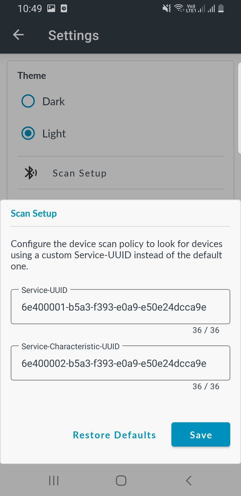

<h1 id="features">Using Pelion Device Management Application for WorkFlow Management</h1>

After you have installed Pelion Device Management Application, you can begin using its features.   

## Login Screen:
Sign In to mobile app using your Pelion Device Management native credentials.
  
</img>

## Select Account :
1. Choose the account/team from the list of accounts.

1. If you are associated with single team then Jobs screen will directly be opened. 

1. From navigation drawer, once account is selected you can switch account by clicking on switch account which will navigate back to accounts page, Also you can select settings and sign out as well.
  
</img> &nbsp;&nbsp;&nbsp;&nbsp;&nbsp;&nbsp;&nbsp;&nbsp;&nbsp;
</img>

## Jobs List Screen :

1. Jobs screen will fetch workflow jobs data from cloud and In Pending tab you can see Job listed which are assigned to you.

1. Each job requires to be performed on the device(s) will require secure device access policy and  if job assigned to you has write file task then a file will also be downloaded by app, so make sure you are connected to internet.

1. If you can see blue color icon on the right of the job cell in the list then it means required data (access policy and file) are downloaded and you will be able be execute job on devices even if you donot have internet connection.

1. If you see yellow color icon then it means access policy/file is not downloaded yet so wait for it to turn into blue icon, If you click on yellow icon cell then inside you will see option to file download / SDA policy download.

1. Each Job cell contain information like Job name, number of device, Secure Access valid date/time, and location.

1. Inside Completed tab you can see all the completed jobs you have executed.

1. In Completed tab, Jobs are listed and there is Upload button which user can use to upload the status/logs of Job to Cloud and that will be synced in portal as well.
  
</img> &nbsp;&nbsp;&nbsp;&nbsp;
</img>&nbsp;&nbsp;&nbsp;&nbsp;
</img>

## Job page :
1. If Secure Device access are valid i.e. SDA policy is not expired (configured by admin from portal while setting SDA policy), then you can see information regarding job and SDA expiry date/time.

1. If SDA token is expired then status is expired and you can see refresh icon, on click of which it will try to renew the SDA policy again (this require internet connectivity).
  
</img>&nbsp;&nbsp;&nbsp;&nbsp;
</img>

## Job execution :
1. Job can be run either by clicking on Run Job button or swiping on particular device on which you want job to be executed.

1. If your Bluetooth is not turn on, then a popup with message "An app is asking to turn on Bluetooth" will come, click on Allow which will turn on bluetooth. Also, If your location are disabled, and you click on Run Job then a popup will open having information about why location service is required, as it requires for scanning nearby BLE devices.

1. If there is no device nearby, Then "No device found" status will be shown with Retry button to re scan nearby BLE devices.

1. When Job execution is going on from mobile to device, the status will be running and once receiving response from firmware status turns to completed.

1. When all the devices assigned to the job has job run completed, status wil change to stopped and finish button will take you to Jobs page.

  
</img>&nbsp;&nbsp;&nbsp;&nbsp;
</img> &nbsp;&nbsp;&nbsp;&nbsp;
</img>&nbsp;&nbsp;&nbsp;&nbsp;
</img>
</img>

## Settings :
1. User can change theme - Light and Dark.

1. Scan Setup - User can configure the device scan policy to look for device using a custom Service-UUID and Service-CharacteristicUUID instead of default one.

1. Help & Support - Customer help and support related to Pelion Device Management along with other informations like Third party libraries we use in app, and documentation.

  
</img> &nbsp;&nbsp;&nbsp;&nbsp;
</img> &nbsp;&nbsp;&nbsp;&nbsp;
</img>&nbsp;&nbsp;&nbsp;&nbsp;
