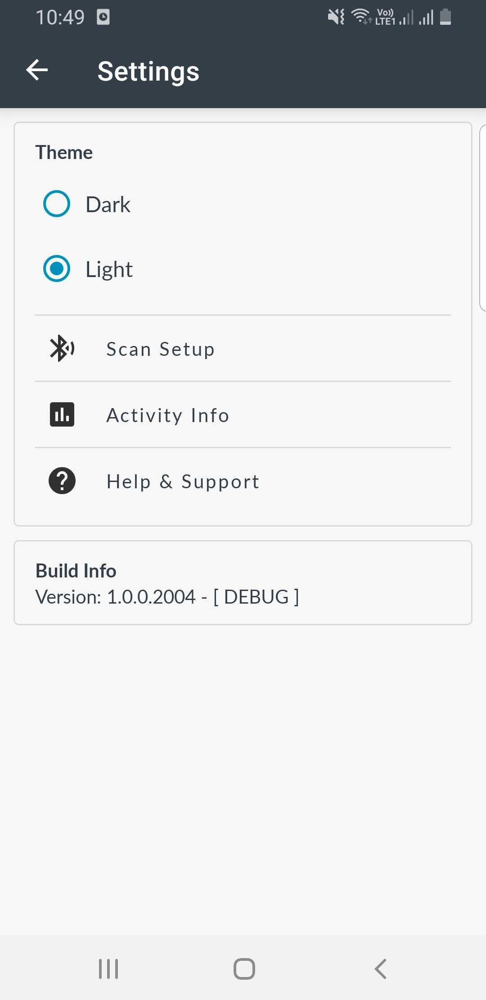
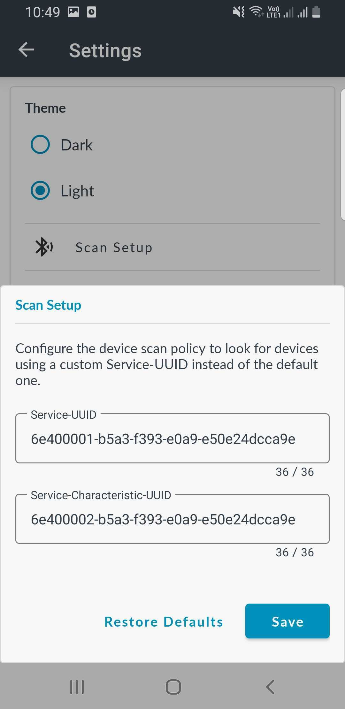

# Workflows with Secure Device Access

This document explains how to use Pelion services to manage workflows that require technicians to perform tasks on IoT devices in areas without internet access.

- [Introduction](#introduction)
- [Terminology](#terminology)
- [Tutorial: Setting up and executing workflows with Secure Device Access (SDA)](#tutorial-setting-up-and-executing-workflows-with-sda)  

## Introduction

Pelion Device Management for Android lets you manage workflows and execute them securely on remote IoT devices.

A workflow might require a technician to configure devices that are offline or outside the network coverage area. The offline setting presents a challenge in validating the identity of the device and the user without accessing the central Identity & Access Management (IAM) system.

Device Management provides two independent, integrated services to provide a solution to this use case:

- Workflow Management Service (WMS)

    Helps define and manage the lifecycle of tasks you perform on remote IoT devices and provides a set of APIs you can integrate with third-party technician management systems to synchronize user identities, the times and locations of jobs, and so on, between systems.

- Secure Device Access (SDA)

    Authenticates and authorizes users who execute jobs on remote IoT device in an offline setting.

    For more information about Secure Device Access (SDA), please see the [public SDA documentation](https://www.pelion.com/docs/device-management/current/device-management/secure-device-access.html).

## Terminology

- **Scope** - A collection of tasks that a technician has permission to perform.
- **Task** - An operation a technician needs to perform on a remote IoT device. You predefine each task and set parameters to control its execution in a specific job.
- **Job** – A list of tasks associated with a specific user and with a specific group of devices in the account. A job has a planned execution time.
- **Job run** – A specific run of a job - carried out using an Android device on an IoT device - including related operational logs and task outputs.

## Tutorial: Setting up and executing workflows with SDA

This tutorial takes you through the steps required to execute a simple use case of enabling a technician to read and write files from and to remote IoT devices.

### Requirements

For this demo, you need:

- A [Device Management account](https://portal.mbedcloud.com/login).

    **Note:** You must have **Secure device access** and **Workflow management** features activated in the account needs to have. You can [open a request](https://portal.mbedcloud.com/contact) to have these features enabled. You also need **Administrator** privileges in the account to create access policies and jobs.

- An [ST DISCO-L475VG-IOT01A](https://os.mbed.com/platforms/ST-Discovery-L475E-IOT01A/) device on which you [install the workflows-with-secure-device-access-client application](https://github.com/armPelionEdge/workflows-with-sda-docs/blob/master/workflows-with-secure-device-access-client.md).

    An IoT device on which you will securely execute the workflows.

- An Android device on which you install the [PDM mobile application for Android](https://github.com/armPelionEdge/peliondevicemanagement-android/releases/latest).

    The PDM mobile application for Android moderates between Device Management and remote IoT device. You use the application to synchronize workflows when connected to Device Management and to execute jobs over BLE in the vicinity of IoT devices.

### Step-by-step guide

1. Create access policies and assign them to user groups:

    1. In Device Management Portal, select **Access management** > **Access policies**.
    1. Activate the job assignments in your account by creating a global policy:
        1. Click **+ New access policy** at the top right of the screen.
        1. Under **Scope**, select **Selected functions** and set it to *run-workflow*.
        1. Set the **Device ID** equal to `*`.

            **Note:** When you set **Device ID** equal to `*` you get a *0 matching device(s) currently in device directory* message. This is expected behavior because your devices are always offline and, therefore, have not registered in your device directory.
        1. Assign the policy to a group or specific user.
        1. Click **Finish**.

        **Note:** Skip these steps if you already have this policy in your account.

    1. Create separate access policies for different groups, users or devices with different scopes.
        1. Click **+ New access policy** at the top right of the screen.
        1. Enter an integer in the **Token granted for** field to define the number of days for which the token is valid. For example, `3` means the token is valid for three days.
        1. Under **Scope**, select **Selected functions** and type one of these options, or both on  separate lines:
            - *read-data*: To read file from the device.
            - *configure*: To write file to the device.
        1. Under **Identify devices** by, select **Endpoint name** and enter your device's endpoint name in the textbox below.

            If you use developer credentials, you can find the device endpoint name in the *mbed_cloud_dev_credentials.c* file you downloaded when you set up the [workflows-with-secure-device-access-client application](https://github.com/armPelionEdge/workflows-with-sda-docs/blob/master/workflows-with-secure-device-access-client.md#building-the-application).

            In production, use the device endpoint name given to the device during the factory provisioning process. For more information about the factory provisioning process, please see the [Pelion Device Management Factory Provisioning documentation site](https://www.pelion.com/docs/device-management-provision/latest/introduction/index.html).

            

        1. Assign the policy to a group or specific user.
        1. Click **Finish**.

    1. Activate your policies:

        1. On the **Access policies** page, click the policy.

            This opens the **Policy details** page on the right side of the screen.

        1. Click **Activate**.

            The **Activate policy** popup window prompts you to confirm policy activation.

        1. Click **Activate policy**.

1. Create, schedule and assign jobs:

    1. In Device Management Portal, select **Job Management** > **Jobs**.
    1. Click **+ Add new job** at the top right corner of the screen.

        This opens the **New job** window.

        
    1. Enter a **Job Name** and **Description**.

        The job name must be unique in the account.

    1. Enter a **Location**.

        This is a text field that you can populate with the most suitable details to enable the assignee to find the location of the devices; for example, zip code or latitude/longitude coordinates in a text format.

    1. Select a user from the **Assign To** dropdown.

        **Note:** Assign each job to a single technician. Only the assigned technician can download the job to their mobile application.

    1. From the **Planned Start** calendar, select a start date and time.

        This indicates to the technician when they are expected to perform the job; the system does not automatically trigger anything at this time.

    1. Click **Add Task** and select:
        - **Read file**: Specify the file path on the target device.
        - **Write file**: Upload a file from your local computer and specify the destination file path on the target device.

        The file path should be a text string. A typical file path is a slash-separated (/) list of directory names followed by a file name. For example - the default mount point on the firmware is set to `/fs` so the file path will be `/fs/filename`. Note that the filename size is limited to 256 characters.

    1. Under **Devices**, select the **Device IDs** or **Endpoint names** option buttons and enter the device ID or endpoint name of the IoT device on which the technician must perform the job.

        To add multiple device IDs or endpoint names use a separate line for each device.

    1. Click **Create Job**.

        Device Management creates the jobs and sets their status to **Pending**.

        After a technician downloads a job, you can no longer edit the job, but you can delete it. When you delete a job that a technician has downloaded, the deleted job remains visible in the system.

1. Log in to the PDM mobile application for Android using the personal Device Management credentials of the technician to whom you assigned jobs.

    **Note:** You need internet access for this step.

    

    If you are associated to a single account, the application opens the **Pending Jobs** page.

    Otherwise, select an account from the list of accounts.

    

    **Note:** Accounts in the PDM mobile application for Android are the equivalent of teams in Device Management Portal.

    To switch accounts, tap **Switch Account** on the navigation bar to navigate back to the **Accounts** page.

    

1. Download assigned jobs using the PDM mobile application for Android.

    When you open the **Pending Jobs** page, the application automatically starts downloading new jobs and synchronizes jobs for offline execution.

    You can also use pull-to-refresh to force the application to synchronize the jobs from Device Management.

    **Note:** You need internet access for this step.

    
    

    Each cell on this page represents a single job assigned to the logged in technician. The information in the cell includes job name, the number of devices on which the technician must execute the job, SDA token expiry date/time, and device location.

    Job states:

    - **Ready** - Blue icon, indicates that the job's assets and a valid SDA token have been synchronized and are ready for offline execution.
    - **All done** - Green icon, indicates that all tasks associated to the job ran on all assigned devices. The job runs are ready to be uploaded to Device Management.
    - **Not available** - Yellow icon, indicates the job is not ready for offline execution because you have not yet downloaded all assets related to the job.
    - **Expired** - Red icon, indicates the token associated to the job has expired and, therefore, the job is not ready for offline execution. Tap the job cell to open the **Job details** page and request a new SDA token.

       **Note:** You need internet access to request a new SDA token.

1. Execute the job on your nearby IoT devices using the PDM mobile application for Android:

    1. Tap a job cell to open the **Job details** page.

    1. Tap **Run Job**.

        

       The application runs BLE discovery for nearby Pelion devices and then starts executing the tasks associated to the job.

       If there are no devices nearby, the application presents a **No device found** message and a **Retry** button, which you can tap to re-scan the nearby BLE devices.

       The application runs the tasks on as many devices as it discovers in its vicinity. You can also execute the job on an individual device by swiping left and tapping **Run**.

        If your Bluetooth is turned off, a dialog box prompts you to turn on Bluetooth.

        If your location is disabled, a similar dialog box appears. You need to turn on location services to scan for nearby BLE devices.

        
        

    1. To stop the execution of the task, tap **Stop** at the bottom of the screen.

        

    1. To view the task status, open the **Job Run** page.

        - **Running** indicates that the task is being executed.
        - **Completed** indicates that the task was executed on the device and the result is stored in the application.
        - **Failed** indicates that the BLE connection between the device and mobile application got terminated.

            

1. Upload the job runs to Device Management:

    1. Open the **Completed Jobs** page.

          This page lists all completed jobs. When a job is marked as completed, it means that all tasks assigned to the job have been executed on all devices associated to the job.

    1. To synchronize the job runs with Device Management, tap the **Upload** button.

        
        

        **Note:** Once the run logs of a job are uploaded to Device Management, the job will be removed from the PDM mobile application for Android on the next login.

1. Inspect the job results in Device Management Portal:

    1. In Device Management Portal, select **Job Management** > **Jobs**.

        Device Management initially assigns all jobs **Pending** status.

        When a technician downloads a job to a mobile device, Device Management updates the status to **In progress**.

        After the job is complete and the technician uploads the job runs, Device Management updates the status to **Complete**.

        Device Management Portal displays job metrics for jobs that are in **In progress** and **Complete** statuses, including any job runs that the technician uploads. There is a separate log for each device on which the technician runs a task.

    1. Click a job from the list to open the **Job details** window for the job.

        

        When a task requires transferring a specific payload to Device Management (for example, “Read file”), the payload is available in the run log for each device. Click the button to download the file to your computer.

## Expected behavior

1. The PDM mobile application for Android marks jobs that are expected to fail as **Completed**, and the Portal provides logs indicating any errors that occurred during the execution. For example, if a job has to read a file that does not exist on the IoT device, the job will run as expected and the mobile application will mark the job **Completed** on the **Job Run** page. After the mobile application uploads the run logs to Device Management Portal, you can view the logs, which will indicate that the file does not exist.

1. A job cannot be rerun after the mobile application marks it as **Completed** and uploads the run logs to Device Management.

## BLE scan setup using the Pelion Device Management mobile application for Android

You can configure the device scan policy to look for a device using a custom service UUID and service characteristic UUID. By default, the values are:

- Service UUID - 6e400001-b5a3-f393-e0a9-e50e24dcca9e, where 0x0001 is the 16bit short UUID.
- Service Characteristics UUID - 6e400002-b5a3-f393-e0a9-e50e24dcca9e, where 0x0002 is the 16bit short UUID.

    
    
