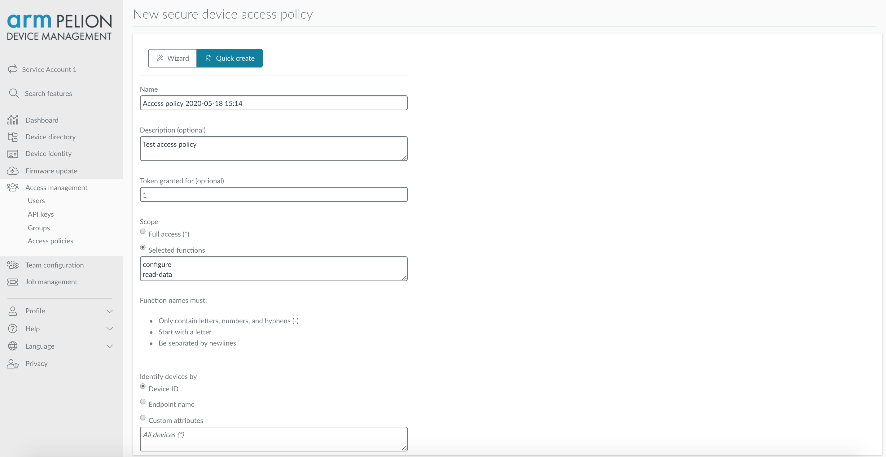
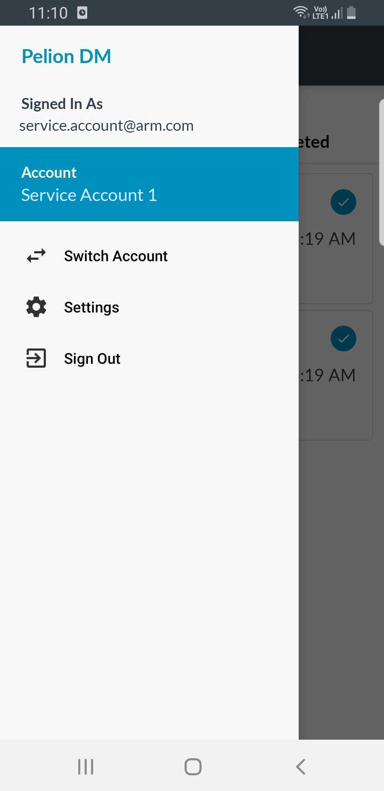

# Workflows with Secure Device Access

This document explains how to use Pelion services to manage workflows that require technicians to perform tasks on IoT devices in areas without internet access.

- [Introduction](#introduction)
- [Terminology](#terminology)
- [Tutorial: Setting up and executing workflows with Secure Device Access (SDA)](#tutorial:-setting-up-and-executing-workflows-with-sda)  

## Introduction

Pelion Device Management lets you manage workflows and execute them securely on remote IoT devices.

A workflow might require a technician to configure devices that are offline or outside the network coverage area. The offline setting presents a challenge in validating the identity of both the device and the user without accessing the central Identity & Access Management (IAM) system.

Device Management provides two independent, integrated services to provide a solution to this use case:

- Workflow Management Service (WMS)

    Helps define and manage the lifecycle of tasks you perform on remote IoT devices and provides a set of APIs you can integrate with third-party technician management systems to synchronize user identities, times and locations of jobs, and so on, between systems.

- Secure Device Access (SDA)

    Authenticates and authorizes users who execute jobs on remote IoT device in an offline setting. For information about Secure Device Access (SDA), please see the [public SDA documentation](https://www.pelion.com/docs/device-management/current/device-management/secure-device-access.html).

## Terminology

- **Scope** - A collection of tasks that a technician has permission to perform.
- **Task** - An operation a technician needs to perform on a remote IoT device. You predefine each task and set parameters to control its execution in a specific workflow.
- **Workflow** – A list of tasks associated with a specific user and with a specific group of devices in the account. A workflow has a planned execution time.
- **Workflow run** – A specific run of a workflow - carried out using an Android device on an IoT device - including related operational logs and task outputs.

## Tutorial: Setting up and executing workflows with SDA

This tutorial takes you through the steps required to execute a simple use case of enabling a technician to read and write files from and to remote IoT devices.

### Requirements

To set up your environment for this demo, you'll need:

- A [Device Management account](https://portal.mbedcloud.com/login).

    **Note:** The account needs to have **Secure device access** and **Workflow management** feature activated. You can [raise a request](https://portal.mbedcloud.com/contact) to get those features enabled. To create access policies and workflows, you also need **Administrator** privileges in the account.

- An [ST DISCO-L475VG-IOT01A](https://os.mbed.com/platforms/ST-Discovery-L475E-IOT01A/) device on which you install the [workflows-with-secure-device-access-client application]((https://github.com/armPelionEdge/workflows-with-secure-device-access-client/blob/master/README.md).

    An IoT device on which you will securely execute the workflows.

- An android device on which you install the [PDM mobile app](https://github.com/armPelionEdge/peliondevicemanagement-android) (Android only).

    A moderator between Device Management and remote IoT device. It synchronizes workflows when connected to Device Management and executes workflows over BLE when in the vicinity of IoT devices.

### Step-by-step guide

1. Create access policies and assign them to user groups:

    1. In Device Management Portal, select **Access management** > **Access policies**.
    1. Activate the workflow assignments in your team by creating a global policy: (???)
        1. Click **+ New access policy** at the top right of the screen.
        1. Under **Scope**, select **Selected functions** and set it to *run-workflow*.
        1. Set the **Device ID** equal to `*`.(???)(???Groups?)
        1. Click **Finish**.

        **Note:** Skip these steps if you already have this policy in your team.

    1. Create separate access policies for different groups, users or devices with different scopes.
        1. Click **+ New access policy** at the top right of the screen.
        1. The **Token granted for** field takes integer values with unit *days*. For example, `3` means the access policy is valid for three days.
        1. Under **Scope**, select **Selected functions** and type one of these options, or both on  separate lines:
            - *read-data*: To read file from the device.
            - *configure*: To write file to the device.
        1. Under **Identify devices** by, select **Endpoint name** and enter your device's endpoint name in the textbox below.

        If you use developer credentials, you can find the device endpoint name in the *mbed_cloud_dev_credentials.c* file you downloaded when you set up the [workflows-with-secure-device-access-client application]((https://github.com/armPelionEdge/workflows-with-secure-device-access-client/blob/master/README.md). In production, use the device endpoint name given to the device during the factory provisioning process. For more information about the factory provisioning process, please see the [Pelion Device Management Factory Provisioning documentation site](https://www.pelion.com/docs/device-management-provision/latest/introduction/index.html).

        

    1. Assign the policy to a group or specific user.
    1. Click **Finish**.
    1. Activate your policy:

        1. On the **Access policies** page, click the policy.

            The **Policy details** page is displayed on the right side of the screen.

        1. Click the icon next to the Inactive label at the top left corner of the pane.

            A popup window prompts you to confirm policy activation.

        1. Click **Activate policy**.

1. Create, schedule and assign workflows: (??? workflows or jobs?)

    1. In Device Management Portal, select **Job Management** > **Jobs**.
    1. Click **+ Add new job** at the top right corner of the screen.

        This opens the **New job** window.

        
    1. Enter a **Job Name** and **Description**. The name should be unique for an account.(???)
    1. Enter a **Location**. This is a text field that you can populate with the most suitable details to enable the assignee to find the location of the devices; for example, zip code or latitude/longitude coordinates in a text format.
    1. Select a user from the **Assign To** dropdown.

        **Note:** Each job must be assigned to exactly one technician and can only be synchronized to the mobile application that the technician is logged into.

    1. From the **Planned Start** calendar, select a start date and time.

        This indicates to the technician when they are expected to perform the job; the system does not automatically trigger anything at this time.

    1. Click **Add Task** and select:
        - **Read file**: Specify the file path on the target device.
        - **Write file**: Upload a file from your local computer and specify the destination file path on the target device.

        The file path should be a text string. A typical file path is a slash-separated (/) list of directory names followed by a file name.

    1. Under **Devices**, select the **Device IDs** or **Endpoint names** option buttons and enter the device ID or endpoint name of the IoT device on which the technician must perform the job. To add multiple device IDs or endpoint names use a separate line for each device. (???does the device have to be registered in PDM?)
    1. Click **Create Job**.

        Device Management creates the jobs and marks its status as **Pending**.

        After the technician downloads the workflow, you can no longer edit it. (???job or workflow?)

        You can only delete the workflow when it is in this state. A workflow that has been downloaded can only be marked as deleted and remains visible in the system. (???)

1. Log in to the PDM mobile application using the personal Device Management credentials of the technician to whom you assigned jobs.

    **Note:** You need internet access for this step.

    

    If you are associated with single team, you are redirected to the **Pending Jobs** page.

    Otherwise, select an account from the list of accounts.

    

    To switch accounts, tap **Switch Account** on the navigation bar to navigate back to the **Accounts** page.

    

1. Download assigned jobs using the PDM mobile app.

    When you open the **Pending Jobs** page, the application automatically starts downloading new jobs and synchronizes jobs for offline execution.

    You can also use pull-to-refresh to force the application to synchronize the jobs from Device Management.

    **Note:** You need internet access for this step.

    
    

    Each cell on this page represents a single job assigned to the logged in technician. The cell contains information, including job name, number of device (???), SDA token valid date/time, and location (??? device location?).

    Job states:

    - **Ready** - Blue icon, indicates that the job's assets and a valid SDA token have been synchronized and are ready for offline execution.
    - **All done** - Green icon, indicates all tasks associated to the job ran on all assigned devices. The workflow runs are ready to be uploaded to Device Management.
    - **Not ready** - Yellow icon, indicates the job is not ready for offline execution as all assets related to the job have not been downloaded.(??? Not available?)
    - **Expired** - Red icon, indicates the token associated to the job has expired; therefore, the job is not ready for offline execution. You can request a new SDA token from the **Job details** page. (??? How do you get there? Tap the job cell?)

       **Note:** You need internet access to request a new SDA token.

1. Execute the job on your nearby IoT devices using the PDM mobile app:

    1. Go to the **Job details** page and tap **Run Job**.

        

       The application runs BLE discovery for nearby Pelion devices, and then starts executing the tasks associated to the job.

       If there are no devices nearby, the application presents a **No device found** message and a **Retry** button, which you can tap to re-scan the nearby BLE devices.

       The application runs the tasks on as many devices as it discovers in its vicinity. You can also execute the job on an individual device by swiping left and tapping **Run**.

        **Note:** If your Bluetooth is turned off, a dialog box prompts you to turn on Bluetooth. If your location is disabled, a similar dialog box appears. You need to turn on location services to scan for nearby BLE devices.

        
        

    1. To stop the execution of the task, tap **Stop** at the bottom of the screen.

    

    1. To view the task status, open the **Job Run** page.

        - **Running** indicates that the task is being executed.
        - **Completed** indicates that the task was executed on the device and the result is stored in the application.

        

1. Upload the workflow runs to Device Management:

    1. Open the **Completed Jobs** page.

      This page lists all completed jobs. This means that tasks assigned to the job have been executed on all devices associated to the job.

    1. To synchronize the workflow runs with Device Management, tap the **Upload** button.

        
        

1. Inspect the workflow results in Device Management Portal:

    1. In Device Management Portal, select **Job Management** > **Jobs**.

        Device Management initially assigns all jobs **Pending** status.

        When a technician downloads a job to a mobile device, Device Management updates the status to **In progress**.

        After the job is complete and the technician uploads the workflow runs, Device Management updates the status to **Complete**.

        Once *In progress* and *Complete*, job metrics are displayed. Any workflow runs uploaded by the assignee can be viewed. Note that there is a separate log for each device to which the task was applied. (??? are there metrics for in progress jobs?)

    1. Click a job from the list to open the **Job details** window for the job.   

        When a task requires transferring a specific payload to Device Management (for example, “Read file”), the payload is available in the run log for each device. Click the button to download the file to your computer.

       
