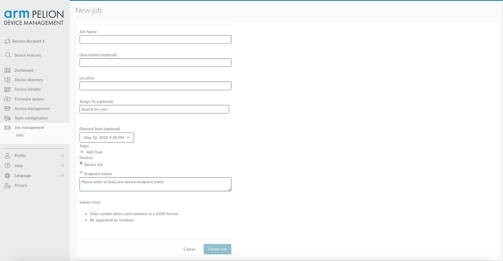
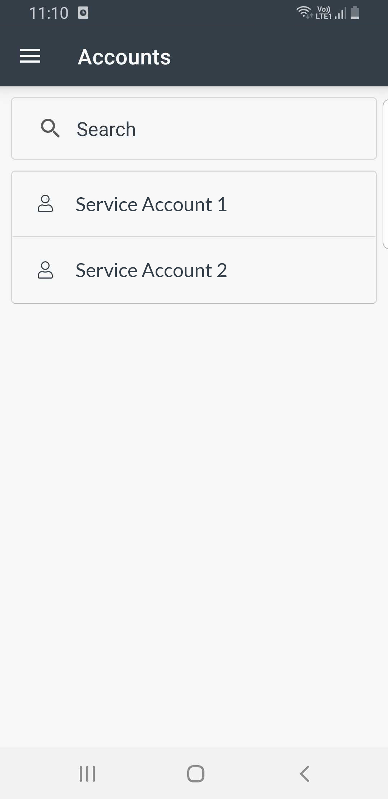

# Workflows with Secure Device Access

## Introduction

Pelion Device Management (PDM) platform can be used to manage workflows and execute them securely on remote IoT devices. The devices which are offline or outside the network coverage area, sometimes needs to be configured in order to continue to perform their defined tasks. The offline setting also brings in a challenge where the identity of both the device and user needs to be validated, as there is no access to central Identity & Access Management (IAM) system.

PDM provides two independent services which are integrated to provide a solution to such a use case -
1. Workflow Management Service (WMS)
This service helps define and manage the life cycle of the tasks to be performed on remote IoT devices. It provides a set of APIs which can be integrated with third party Technician management systems. For example, user identities, times and locations of jobs could be synchronized between the systems.

1. Secure Device Access (SDA)
It authenticates and authorizes users, who might also be offline to execute jobs on remote IoT device. For information about Secure Device Access (SDA), please see the [public SDA documentation](https://www.pelion.com/docs/device-management/current/device-management/secure-device-access.html).

## Terminology

- **Task** - An operation that needs to be performed on a remote IoT device. Tasks can be of specific pre-defined types. Each type has a set of parameters to control its execution in a specific workflow.
- **Workflow** – A list of tasks, associated with a specific user and with a specific group of devices in the account. A workflow has a planned execution time.
- **Workflow Run** – A specific run (by the mobile device on the Pelion device) of a workflow, that contains operational logs and task outputs.

## Application
Let's consider a simple use case where the requirement is to securely read and write files from and to remote IoT devices.

## Components
You will need access to following components in order to setup your environment to test this feature -
1. A [PDM account](https://portal.mbedcloud.com/login). You will use this Portal to manage user access polices and the life cycle of the workflows.

    **Note:** The account needs to have **Secure device access** and **Workflow management** feature activated. You can [raise a request](https://portal.mbedcloud.com/contact) to get those features enabled. Also, to create access policies and workflows, you also need **Administrato** priviledges of the account.

1. An [ST DISCO-L475VG-IOT01A](https://os.mbed.com/platforms/ST-Discovery-L475E-IOT01A/) device.
A Pelion managed device which will securely execute the workflows.

1. A [PDM Mobile app](https://github.com/armPelionEdge/peliondevicemanagement-android) (Android only).
A moderator between PDM and remote IoT device. It syncs workflows when connected to PDM and executes workflows over BLE when in the vicinity of the IoT devices.

## Step-by-step guide

1. Deploy an IoT device. Follow these [instructions](https://github.com/armPelionEdge/workflows-with-secure-device-access-client/blob/master/README.md) on how to build and flash your DISCO device.
1. Using Portal, create access policies and assign them to user groups.
    1. Navigate to **Access Policies** under **Access Management**.
    1. Activate the workflow assignments in your team by creating a global policy. Skip these steps, if you already have this policy in your team.
        1. Start new policy by clicking **+ New access policy**, on top right corner.
        1. Under **Scope**, select **Selected functions** and set it to *run-workflow*.
        1. Set the **Device ID** equal to *.
    1. Create separate access policies as per your requirements for different groups, users or devices with different scopes.
        1. Start new policy by clicking **+ New access policy**, on top right corner.
        1. The **Token granted for** field takes integer values with unit *days*. For example 3 means, the access policy will be valid for 3 days.
        1. Under **Scope**, in **Selection functions** field, type one of the following option or both on a separate line:
            1. *read-data*: To read file from the device.
            1. *configure*: To write file to the device.
        1. Under *Identify devices* by, select the *Endpoint name* option button.
        1. In the **Values** field, enter your device's endpoint name.
        In developer mode, you can find the device endpoint name in the *mbed_cloud_dev_credentials.c* file you downloaded earlier. In production, use the device endpoint name given to the device during the factory provisioning process. For more information about the factory provisioning process, please see the [Pelion Device Management Factory Provisioning documentation site](https://www.pelion.com/docs/device-management-provision/latest/introduction/index.html).
    1. Assign the policy to a group or specific user.
    1. Save the policy.
    1. Click **Activate** on **Policy details** page to enable the policy.
    

1. Using Portal, create, schedule and assign workflows.
    1. Navigate to **Jobs** under **Job Management**.
    1. Create a new job by clicking **+ Add new job**, on top right corner.
    1. Enter the **Job Name** and **Description**. The name should be unique for an account.
    1. Enter the **Location**, this is just a text field which can be formatted in the most suitable way for the assignee to find the location of the devices, for example zip code or latitude/longitude coordinates in a text format.
    1. **Assign** the job to a user. Note that each job must be assigned to exactly one user, and can only be synchronized to the mobile app which that user is logged into.
    1. Assign a planned start date and time. This is indicative to the user when they are expected to perform the job (it does not automatically start at that time).
    1. Add the **Tasks**
        1. *Read*: Specify the file path on the target device.
        1. *Write*: Select a file from your local computer to upload and sepcify the file path on the target device.
    The file path should be a text string. A typical file path is a slash-separated (/) list of directory names followed by a file name.
    1. Specify the **Devices** on which the job has to be performed. To add more than one **Device IDs / Endpoint names** use separate lines.
    1. Create the job.
    1. All jobs are initialized to a *Pending* state when created.
        - Once a workflow is downloaded, it can no longer be edited.
        - Also, you can only delete the workflow when it is in this state. A workflow that was downloaded can only be marked as deleted and would remain visible in the system.

    

1. User to whom jobs are assigned - install PDM mobile app and login using personal PDM credentials.
    1. Select the account/team from the list of accounts.
    1. If you are associated with single team then you will be directly redirected to the **Pending Jobs** page.
    1. From navigation drawer, if you wish to select another account you can click on **Switch Account** which will navigate back to accounts page.

        
        
        

    **Note:** Make sure you have Internet access for this step to complete successfully.

1. Using PDM mobile app, download the assigned jobs.

    When on the **Pending Jobs** page, the app will automatically starts downloading new jobs and sync it for offline execution. Pull down refresh is available to manually force the app to sync the jobs from PDM. Each cell on this page is dedicated to an individual job (distinguisable by unique name) assigned to the logged in user. The cell contains information like Job name, number of device, SDA token valid date/time, and the location.

    **Note:** Make sure you have Internet access for this step to complete successfully.

    Job states -

    - *Ready* - represented by blue color icon, indicating that the job's assests and valid SDA token has been synced and is ready for offline execution.
    - *All done* - represented by green color icon, indicating all tasks associated to the job has ran on all the assigned devices. The workflow runs are ready to be uploaded to PDM.
    - *Not ready* - represented by yellow color icon, indicating that the job is not ready for offline execution as all assests related to the job have not been downloaded.
    - *Expired* - represented by red color icon, indicating that the token associated to the job has expired, thus the job is not ready for offline execution. User can request for a new SDA token by going into the **Job details** page. Note: for requesting new SDA token you will need Internet access.

        
        

1. Using the PDM mobile app, execute the job on the remote IoT devices.
    1. Go to the **Job details** page and click on **Run Job** button. The app will start BLE discovery for nearby Pelion devices, once found it will then start executing the tasks associated to the job. The app will run the tasks on as many devices as it discovers in its vicinity. The user has also an option to execute the job on an individual device by swipping left and clicking on the run button.

    **Note:** If your Bluetooth is turned off, then a dialog box will appear requesting user to turn on Bluetooth. Similarly, if your location is disabled, similar dialog box will appear. Location service is needed to scan the nearby BLE devices.

    1. You can stop the execution of the task by clicking on the **Stop** button, located at the bottom of the screen.
    1. If there are no devices nearby, then **No device found** status will be shown with retry button to re-scan the nearby BLE devices.
    1. You can view the status of the tasks on **Job run** page.
        - *Running* indicates that the task is under execution.
        - *Completed* indicates that the task has been performed on the device and the result is stored in the application.

          
        
        
        
        
        

1. Upload the workflow runs to PDM.
    1. The **Completed Jobs** page lists all the jobs which have been completed, meaning the tasks assigned to the job has been executed on all the devices associated to the job.
    1. To sync the workflow runs with PDM, click on **Upload** button.

        
        

1. Using Pelion Portal, inspect the workflow results.
    1. Navigate to **Jobs** under **Job Management**.
    1. All jobs are initialized to a *Pending* state when created.
    1. Once a job has been synchronized to a mobile device by the assignee, the status will update to *In progress*.
    1. When the job is completed and the assignee has uploaded the workflow runs, the status updates to *Complete*.
    1. While in the *Pending* state, minimal details can be seen for a job.
    1. Once *In progress* and *Complete*, job metrics are displayed. Any workflow runs uploaded by the assignee can be viewed. Note that there is a separate log for each device to which the task was applied.
    1. If a Task requires a specific payload to be transferred back to Pelion (e.g. “Read file”) then the payload will be available in the run log for each separate device. Click the button to download the file to your local computer.

    